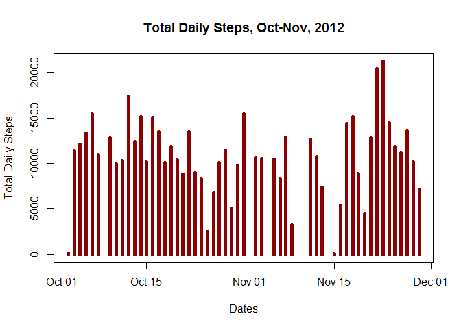
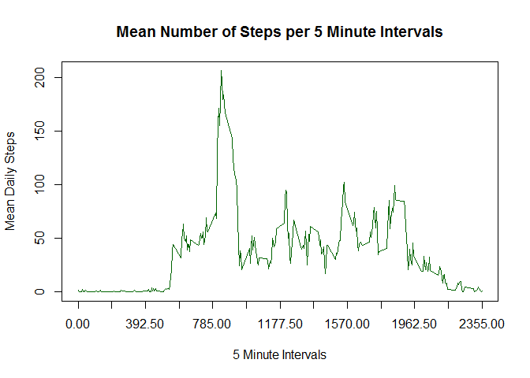
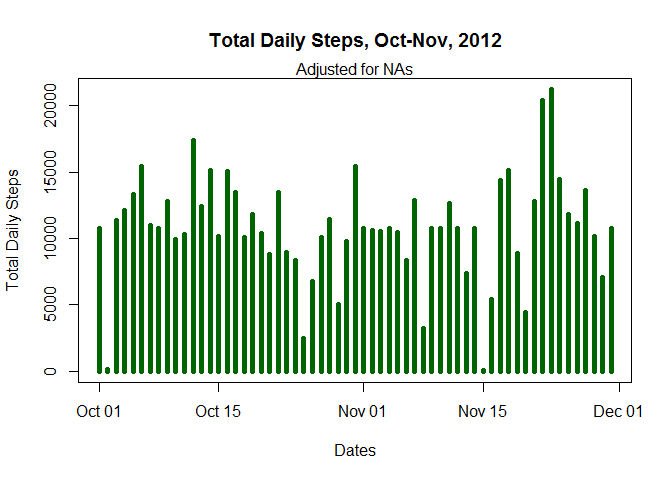
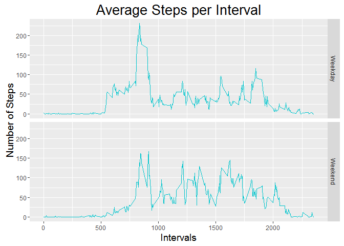

# Reproducible Research Assignment, Week 2
Dorothy Buckley  
August 21, 2016  

## Introduction
This assignment makes use of data from a personal activity monitoring device. This device collects data at 5 minute intervals throughout the day. The data consists of two months of data from an anonymous individual collected during the months of October and November, 2012 and include the number of steps taken in 5 minute intervals each day.  The data for this assignment can be downloaded from the course web site [Activity Monitoring Data] [1].

## Preparation
### Load required packages

```r
library(rmarkdown)
library(tidyr)
library(dplyr)
```

```
## 
## Attaching package: 'dplyr'
## 
## The following objects are masked from 'package:stats':
## 
##     filter, lag
## 
## The following objects are masked from 'package:base':
## 
##     intersect, setdiff, setequal, union
```

```r
library(ggplot2)
```

```
## Warning: package 'ggplot2' was built under R version 3.2.5
```

```r
library(grDevices)
```

### Download data set into working directory.  Read file; look at data to see if it needs to be tidied.

```r
read.csv2("./activity.csv") -> act
str(act)
```

```
## 'data.frame':	17568 obs. of  1 variable:
##  $ steps.date.interval: Factor w/ 17568 levels "0,10/10/2012,100",..: 15265 15490 15266 15337 15400 15459 15462 15473 15476 15487 ...
```

CSV file shows 3 columns, but data set only shows 1 variable.  

### Tidy Data
Tidy data by separating variable "steps.date.interval" into 3 columns:
1. Steps
2. Date
3. Interval

Change classes
- Date variable from character to date
- Steps variable from character to numeric
- Interval variable from character to numeric

```r
separate(act, steps.date.interval, c("steps", "date", "interval"), sep = ",") %>% mutate(newdate = as.Date(date, "%m/%d/%Y")) %>% select(steps, interval, newdate) -> act

as.numeric(act$steps) -> newsteps
```

```
## Warning: NAs introduced by coercion
```

```r
as.numeric(act$interval) -> newinterval
newsteps -> act[,1]
newinterval -> act[,2]
filter(act, steps != "NA") -> newact
str(newact)
```

```
## 'data.frame':	15264 obs. of  3 variables:
##  $ steps   : num  0 0 0 0 0 0 0 0 0 0 ...
##  $ interval: num  0 5 10 15 20 25 30 35 40 45 ...
##  $ newdate : Date, format: "2012-10-02" "2012-10-02" ...
```

## Process dataframe *minus NAs*
### What is mean total number of steps taken per day? Create a histogram.

```r
group_by(newact, newdate) %>% summarize(sum(steps)) -> totaldailysteps
c("newdate", "sum") -> names(totaldailysteps)

with(totaldailysteps, plot(newdate, sum, type="h", lwd=5, col="darkred", xlab="Dates", ylab="Total Daily Steps", main="Total Daily Steps, Oct-Nov, 2012"))
```

 

### Calculate the mean and median number of total number of steps taken daily.

```r
group_by(newact, newdate) %>% summarize(mean(steps)) -> meandailysteps
c("newdate", "stepmean") -> names(meandailysteps)
summarize(meandailysteps,mean(stepmean)) -> m
group_by(newact, newdate) %>% summarize(median(steps)) -> mediandailysteps
c("newdate", "stepmedian") -> names(mediandailysteps)
summarize(mediandailysteps,median(stepmedian)) -> med
```
### Analysis
The median number is 0 for every day, so at least half of each day is spent in non-step activity (sleeping, sitting, etc.).  The mean is 37.3825996.

### What is the average daily activity pattern?

```r
group_by(newact, interval) %>% summarize(mean(steps)) -> meanatintervals
c("interval", "smean") -> names(meanatintervals)

with(meanatintervals, plot(interval, smean, type="l",col="darkgreen", xaxp=c(0,2355,12), xlab="5 Minute Intervals", ylab="Mean Daily Steps", main="Mean Number of Steps per 5 Minute Intervals"))
```

 

```r
summarize(meanatintervals, max(smean)) -> t
filter(meanatintervals, smean==as.numeric(t)) %>% select(interval) -> topinterval
print(topinterval)
```

```
## Source: local data frame [1 x 1]
## 
##   interval
##      (dbl)
## 1      835
```
### Analaysis
The 5 minute interval with the maximum number of steps is the 835 interval, or 8:35am.  There is a spike of step activity in the morning hours between 8:00am and 9:30am, possibly indicating morning commute to work.

## Process dataframe *with NAs*
### Imputing missing values (use original dataframe with NAs)

After reviewing the CSV file, I see the NA values for step numbers affect a limited number of days.  These days *only* have NAs for step numbers.  The other days have a mix of positive numbers and 0's, reflecting step activity or nonactivity. A working assumption is that the test subject may have had the device turned off those days replete with NAs.

With this assumption, it makes more sense to me to replace NA values with the mean values per interval.  There is no mean value for the missing days, and the recorded median values are all 0.

### Replace NAs with interval mean values calculated earlier

```r
left_join(act, meanatintervals, by="interval") -> act
st <- is.na(act$steps)

for (i in 1:length(st)) {
 if (st[i]==TRUE) {
    act$steps[i] <- act$smean[i]
  }
}
select(act, 1:3) -> act
```

### What is mean total number of steps taken per day *with NAs replaced by interval means*? Create a histogram.

```r
group_by(act, newdate) %>% summarize(sum(steps)) -> totaldailystepsna
c("newdate", "sum") -> names(totaldailystepsna)

with(totaldailystepsna, plot(newdate, sum, type="h", lwd=5, col="darkgreen", xlab="Dates", ylab="Total Daily Steps", main="Total Daily Steps, Oct-Nov, 2012"))
mtext("Adjusted for NAs")
```

 

### Calculate the mean and median number of total number of steps taken daily *with NAs replaced by interval means*.

```r
group_by(act, newdate) %>% summarize(mean(steps)) -> meandailystepsna
c("newdate", "stepmean") -> names(meandailystepsna)
summarize(meandailystepsna,mean(stepmean)) -> mna

group_by(act, newdate) %>% summarize(median(steps)) -> mediandailystepsna
c("newdate", "stepmedian") -> names(mediandailystepsna)
summarize(mediandailystepsna,mean(stepmedian)) -> medna
```
### Analysis
The mean is 37.3825996 and the median is 4.4738633.  The mean did not change but the median value did. This is to be expected since the method of replacing the mean interval values for each day is the same for each day.  The histogram shows the missing days filled with the same mean value.

### Are there differences in activity patterns between weekdays and weekends?
Add column for weekday/weekend to dataframe

```r
mutate(act, day=weekdays(act$newdate)) -> act
day <- c("Sunday", "Monday", "Tuesday", "Wednesday", "Thursday", "Friday", "Saturday")
dow <- c("Weekend", "Weekday", "Weekday", "Weekday", "Weekday", "Weekday","Weekend")
cbind(day, dow) %>% as.data.frame() -> w
left_join(act, w, by="day") -> act
```

```
## Warning in left_join_impl(x, y, by$x, by$y): joining factor and character
## vector, coercing into character vector
```

### Create a histogram.

```r
theme1 <- theme(plot.title=element_text(size=20), axis.title=element_text(size=14), axis.text=element_text(size=9), complete=FALSE)

plot3 <- ggplot(act, aes(interval, steps))
plot3 + facet_grid(dow~.) + labs(title="Average Steps per Interval", x="Intervals", y="Number of Steps") + theme1 + stat_summary(fun.y = mean, geom = "line", size = .5, color="turquoise3")
```

 

### Analysis  
The early morning hours on weekdays show higher activity than on weekends.  The afternoon hours on weekends show higher activity than on weekdays.

[1]: https://d396qusza40orc.cloudfront.net/repdata%2Fdata%2Factivity.zip/ "Activity Monitoring Data"
